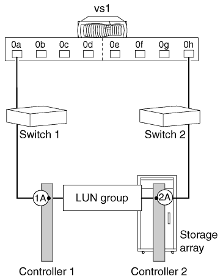

= スタンドアロンの基本的な構成
:allow-uri-read: 
:icons: font
:imagesdir: ../media/

[role="lead"]
アレイLUNを使用するONTAPシステムのスタンドアロンの基本的な構成は、1つのFCイニシエータポートペアが1つのLUNグループにアクセスする単純なファブリック接続構成です。

この構成は、お使いのシステムで実行されているONTAPのリリースのサポート対象としてInteroperability Matrixに記載されているすべてのストレージアレイで使用できます。

この構成を次の図に示します。

* 関連情報 *

https://mysupport.netapp.com/matrix["NetApp Interoperability Matrix Tool"]
