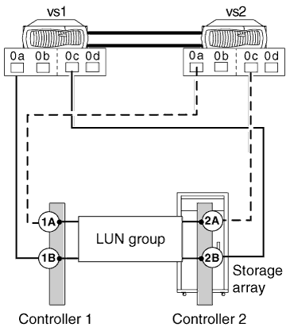

= Eシリーズ ストレージ アレイでサポートされる直接接続型構成
:allow-uri-read: 
:icons: font
:imagesdir: ../media/

[role="lead"]
ONTAPシステムは、E-Seriesストレージアレイと直接接続型の構成で接続できます。単一点障害の可能性を回避するために、ONTAPシステムとストレージアレイの間の接続の冗長性を検証する必要があります。FlexArrayストレッチMetroClusterでは、E-Seriesストレージアレイとの直接接続型構成がサポートされます。詳細については、およびを参照してください https://mysupport.netapp.com/matrix["NetApp Interoperability Matrix Tool"] https://docs.netapp.com/us-en/ontap-metrocluster/install-stretch/index.html["Stretch MetroClusterのインストールと設定"]。

ONTAPシステムとの直接接続型構成でサポートされる特定のE-Seriesアレイモデルについては、Interoperability Matrixを参照してください。

ONTAPでは、E-Seriesストレージアレイで次の直接接続型構成がサポートされます。

== スタンドアロンの基本的な構成

スタンドアロンの基本構成では、ONTAPシステムの2つのFCイニシエータポートが2ポートアレイLUNグループのポートにアクセスします。

次の図は、ONTAP FCイニシエータポート0aおよび0hが2ポートアレイLUNグループのターゲットポートにアクセスする直接接続型の構成を示しています。

image::../media/da_2port_standalone.gif[DA 2ポートスタンドアロン]

== 4ホオトノアレイLUNクルウフ

接続の冗長性を確保するために、HAペアを構成する各ONTAPシステムの2つのFCイニシエータポートが4ポートアレイLUNグループの異なるストレージアレイポートにアクセスします。

次の図は、ONTAP FCイニシエータポートが4ポートアレイLUNグループのターゲットポートにアクセスする直接接続型の構成を示しています。

また、HAペアの各ONTAPシステムの4つのFCイニシエータポートを2つの異なる4ポートアレイLUNグループに接続し、ポートペアの各FCイニシエータポートが代替LUNグループにアクセスできるようにすることもできます。

次の図は、ONTAP FCイニシエータポートが2つの4ポートアレイLUNグループのターゲットポートにアクセスする直接接続型の構成を示しています。

image::../media/direct_attached_configuration_with_two_four_port_array_lun_groups.gif[4ポートのアレイLUNグループを2つ使用した直接接続型の構成]

== 8ホオトノアレイLUNクルウフ

接続の冗長性を確保するために、HAペア内の各ONTAPシステムの4つのFCイニシエータポートが8ポートアレイLUNグループ内の異なるストレージアレイポートにアクセスします。

次の図は、ONTAP FCイニシエータポートが8ポートアレイLUNグループのターゲットポートにアクセスする直接接続型の構成を示しています。

image::../media/eight_port_direct_attached_ha_pair_configuration.gif[8ポート直接接続型のHAペア構成]
